# Frequently Asked Questions (FAQ)

## Why would you do this?

I realize that at first glance this design seems like over-kill for empowering users to have their data. At the very least, it seems like the easier thing to do would be __to just write an application that gave users via the application itself__ the full ability to do what they want with their data: download it, modify it, delete it, etc. You would be correct.

I would argue that historically (for what limited time the internet has existed) that empowering users to own their data has at best been an after-thought of an application developer. At worst, of course, is what we have currently: where everyone's favorite application wholly owns community contributed content.

The goal of this project is an experiment; to see what it would be like (if possible _and_ practically feasible) if we can empower application writers to give their users their data as a first class option: Meaning instead of giving users access to their data via the application layer; give them access to their data at the _data layer_. In other words: what if an application developer could tell their users: bring your own database (infastructure), and we'll give you your data.

## Why not just use ActivityPub or some other protocol?

In my view, ActivityPub solves a different problem, which is federated content distribution. From a full-stack application overview, a user of a site that leverages ActivityPub still doesn't have a guarantee by the application author of rights to their data, or what they are doing with their data. As a user of an application leveraging ActivityPub, you are empowered to get content from elsewhere, but you are not necessarily empowered for full access data to your own content; you are still dependent on getting your content through the application layer.

To be clear: Treaty isn't competing with ActivityPub, I would assert that Treaty fills a product need that is complimentary to the interests of federated protocols like ActivityPub.

## What do you mean by first-class data access?

A little bit of context may be helpful. Treaty was born out of an idea after a leader of a social network submitted testimony to Congress years ago. 

At the time I thought as a business intelligence developer: wouldn't it be nice if that social network just gave me a SQL login to their database and I could (jokingly) "`SELECT * FROM TABLE WHERE USER = ME`" for the data that pertained to me? Why can't I just see what they actually have in their database about myself?

That idea is the thesis behind Treaty.

## Isn't allowing users data layer access to their data _dangerous_ (in terms of referential integrity?)

__Yes__. If you've walked through the [demo](/treaty/docs/demo.md), you'll see how Treaty attempts to surface situations where data is inconsistent between a Host and a Participant. This is an expected outcome of an idea of _cooperative data_: that users of an application who are empowered to have access to their data also understand the consequences of what that data access means.

The practical hope is that Treaty empowers users to have _options_: ideally a user never really needs to modify data that they have access to; but that they _do_ have an option to do so. In addition, they're also empowered to do what they want with their data: build reports on top of it, or import it into another application, and so on.

For an application developer using Treaty, the goal is also to empower application developers to be made aware of these situations (inconsistent or missing results, and so on) so that they can be handled _gracefully_.

## Isn't the _authority over data_ statement here a lie? Can't an application writer still do what they want with my data?

__Yes__. Although I argue that this problem exists today regardless. In other words: Although you have your data that Treaty tries to empower you to have (and make modifications to); because data still must pass through an application layer that someone else has authored, you still can't be 100% certain that the application author hasn't done something else with your data. 

In other words: Unless a user of an application has full visibility and authority to ensure the path of their data (from inputting information into a text box on a webpage) all the way through the stack (from the webpage to the API down to the database) is secure, there is no assurance that something else isn't being done with their data. Most open source software projects attempt to account for this through legal means: licensing their software via [AGPL](https://www.gnu.org/licenses/agpl-3.0.en.html) or similar.

```mermaid
---
title: A typical application stack
---
flowchart LR
    user(["User 👩🏾‍💻"]) --> app([Website]) <--> api[Application API] <--> db[(Database)]
```

```mermaid
---
title: How an application might work with Treaty
---
flowchart LR
    subgraph Users
    user(["👩🏾‍💻"])
    end 
    subgraph Your Infastructure
    user --> app([Your Website]) <--> api[Website API] <--> apptreaty["Website (Host) Treaty API"] <--> db[("Website (Host) Database")]
    end 
    subgraph "User (Participant) Infastructure"
    user --> usertool["Treaty Admin Website"] --> parttreaty["User (Participant) Treaty API"] <--> partdb[(Partial Database)]
    apptreaty <-- Data Contract -->  parttreaty
    end
```

## Aren't there bigger architecture problems here? Isn't this architecture practically infeasible? Isn't there latency and [CAP](https://en.wikipedia.org/wiki/CAP_theorem) theorem problems here?

__Yes__. The best network hop is the one you didn't need to make. The goal for Treaty is to try and slowly (eventually) tackle each of these problems and _gracefully empower the application author as well_ to account for these situations.

## Isn't this the same idea as the [Solid](https://solidproject.org/) project? 

Mostly. I actually tried for a little bit to make the Solid protocol work with C# (project is [here](https://github.com/dynamoRando/solidproject-dotnet-examples)).

I found myself struggling a bit with concepts such as [RDF](https://www.w3.org/RDF/) and others. I wanted to natively work with tooling that I was already familiar with: SQL.

## I'm noticing at lot of problems with your code. Is this a "for real" project?

Yes to problems. Maybe to "for real".

Treaty is a project that I worked on while teaching myself Rust. It's actually the latest iteration of the same idea I've tried to implement in other projects.

It's also a project that I've been working on in my spare time. I admit there are a lot of problems with my code base and I'm slowly working where I can to close that gap. I want to ensure that Treaty is a useful experiment, if nothing else. I welcome kind and tactful feedback. I am also open to mentorship, if provided.

