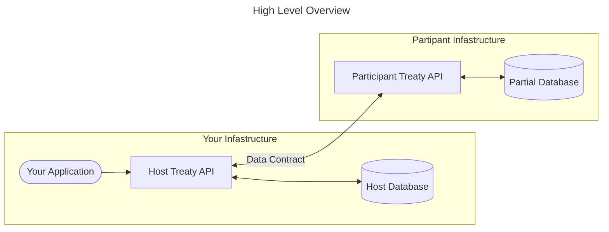
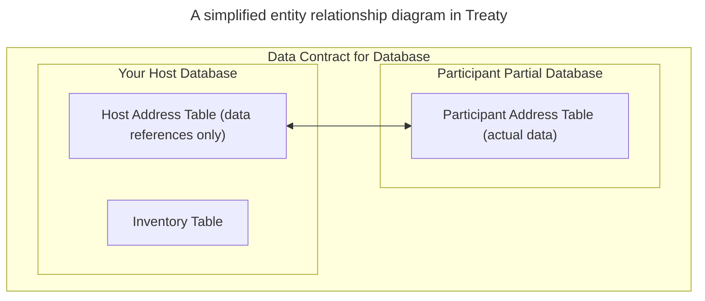

# Treaty 
An experimental data sharing service. 📜 🤝 

A data API written to support application developers who want to give their users rights to their application data.

# What is `treaty`
`treaty` is an intermediate API that sits on top of a database system that enables cooperation of data between the _author (or host)_ of a database and _participants_ of the database. Your application talks to `treaty`, and `treaty` talks to a local database and the corresponding _partial_ databases that are remote from the host.



Practically, you utilize normal SQL statements to send to Treaty, which executes them on your application's behalf against your database or your users database. When you want to give a user of your application (known to Treaty as a _participant_) their data, you instruct Treaty which SQL statement belongs to which user (participant), and Treaty takes care of the rest. 

Treaty is for application developers who want to give their users access to their data. It's also for users who want ownership of their data: to determine where it's stored; and the ability to query and modify it via SQL.

## Databases
`treaty` is currently implemented on top of Sqlite and Postgres. `treaty` is written in Rust. While `treaty` is written in Rust, the underlying communication is defined via gRPC. See the [proto](/treaty/proto/treaty.proto) file for the definition to generate a client in the language of your choice (Python, Go, C#, etc.)

## Transport
`treaty` is implemented using gRPC (via protobuf) or HTTP (via JSON). The hope is to also support in the future: Websockets and Native Postgres.

# What is Cooperative Data

Treaty is the implementation of an idea called "Cooperative Data."

_Cooperative Data_ is the idea that the author of a database system often holds information that usually belongs to someone else. An example is if a database author is building an online commerce storefront. The online store probably has records for inventory and customer information. In this example, the inventory information _belongs_ to the online retailer, but the customer information (such as Shipping Address, Billing Address, and so on) belong to the _customers_.

In this situation, `treaty` enables data to physically be split in a database system. Data that belongs to the online retailer will be saved in a database created by the online retailer, and data that belongs to the customers will be saved in databases that the customers choose to host elsewhere. To both, the database schema remains the same, and ownership and behavior of data is defined by a _database contract_. Data for our users (called _participants_ from the perspective of Treaty) is saved to their databases by write statements identifying the participant.



The idea for `treaty` (and other related projects) is inspired by agricultural and/or food cooperatives.

## Where to start

If this seems like a complicated concept, it's because it is. For background I recommend starting with the [demo](/treaty/docs/demo.md) which is a bit long and also and reading the [FAQ](/treaty/FAQ.md). There is also the manual, which is a continual work in progress.

# Library overview

This crate contains a few projects:

- treaty: an API that sits on top of a database to enable cooperative data. 
- treaty-tests: integration tests between `treaty-client` and `treaty` or `treaty-proxy`.
- treaty-client: a native Rust client used to talk to a treaty instance.
- treaty-client-wasm: a native web assembly (WASM) Rust client used to talk to a treaty instance. This is not feature complete compared to `treaty-client`.
- treaty-proxy: an API that abstracts _multiple_ treaty instances. This is intended to support a single server hosting multiple treaty accounts; akin to a Software as a Service implementation. 
- treaty-types: a re-export of the .proto structs for compat with web assembly (WASM) applications, along with some other helper modules.

There is also a "demo" bin that is used in the [demo](/treaty/docs/demo.md) walkthru if you don't want to write the demo code yourself.

There are a few other related repos not included in this crate:
- treaty-admin: a web assembly application for managing a treaty instance. This is analogous to other SQL admin tools such as pgadmin or MySQL Workbench.
- treaty-my-info: a web assembly application for managing a `treaty-proxy` instance. This is similiar to above in implementation. 

# Documentation

For a [quickstart](/treaty/docs/quickstart.md), [demo](/treaty/docs/demo.md), or the [manual](/treaty/docs/manual.md), see the `docs` folder. For information about features, see the [Roadmap](/treaty/ROADMAP.md). There is also the [FAQ](/treaty/FAQ.md).

# Build notes

If you're attempting to build this on Ubuntu, you will need
- build-essentials

```bash
sudo apt install build-essential
```

- protobuf compiler

```bash
sudo apt install protobuf-compiler libprotobuf-dev
```
- openssl and dev 

```bash
sudo apt install openssl libssl-dev
```

# What Treaty is not

Treaty is not an ORM (such as `Diesel` or `SeaORM` for Rust) nor a SQL toolkit (such as `SQLx`.) It is intended to be a "thin" API that is opinionated on how and where you store data for your application. 

It's goal is to enable software developers who want to the ability to give their users their data back to them.

# Other referenced projects
- Antlr, at [antlr.org](https://www.antlr.org/license.html) under BSD-3 license. Used for parsing Sqlite statements.
- gRPC, at [grpc.io](https://grpc.io/), under Apache 2.0 and Creative Commons 4.0. Used to implement the `proto` file.

# Similar projects

Treaty conceptually is similiar to the [Solid project](https://solidproject.org/). The difference between Treaty and Solid is that while Solid is [specification based](https://solidproject.org/TR/protocol), Treaty is _software and patterned based_: gRPC defined first, with SQL based implementations in Sqlite and Postgres. Treaty is an implementation of a design pattern (cooperative data). 

The goal for Treaty is to reduce the mental friction of this proposed design pattern of cooperative data. I hope to build an API where developers can "bring their own database" and just write apps as quickly as possible (in the language of their choice) while still respecting the data rights of their users. Users can get first-class access to their data at the data layer, and optionally can "bring their own database (infastructure)" to store their data.

# License
This software is licensed under the Apache 2.0 and MIT license. Use whichever works for you.

# Remarks

Treaty is an experiment, and may not be suitable for production environments. In addition, as of the time of this writing, I do not have an offical release although I am working towards one. The API is pre-version 1.0, and is highly likely to change.

This project is an effort of an idea I am pursuing in my spare time, and can only devote a few hours a week to it. Please be patient if I am not quick to respond to requests or questions.

Copyright 2023 Randy Le.