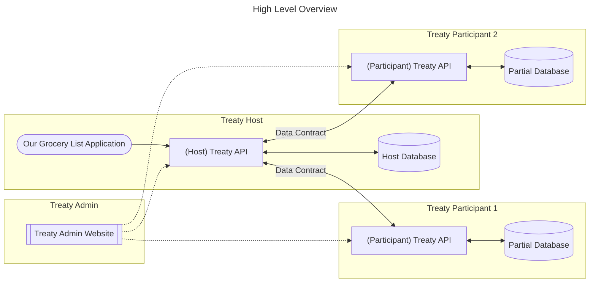

# Demo

> Note: This demo uses docker, and is targeted for version `0.1.0-alpha`. It works against Sqlite. In the future I hope to support/implement a path where the overhead of setting up your database structures (perhaps in a NoSQL-like fashion) is not so up-front. This demo is written in Rust, although not idiomatic Rust. The docker images are based on `debian:oldstable-slim` at the time of this writing (June 2023).

This demo will walk you through creating a simple command line interface (cli) application using the `treaty-client` crate in Rust to talk to an example `treaty-host` container and a few `treaty-participant` containers. 

The [demo](/treaty/demo/) project contains all the code you will need if you'd like to follow along (and not have to write anything yourself.)

To inspect the results in the host or partial databases, you can use the `treaty-admin` website to connect to any of the treaty instances in this scenario. `treaty-admin` is an admin tool for `treaty`; analogous to other SQL admin tools such as pgadmin or MySQL Workbench.

Our supporting docker containers can be constructed by using the [docker-compose](/docker-compose/treaty-demo/docker-compose.yml) file.

At a high-level, this solution looks like this:



While `treaty` is built in Rust, the underlying communication is defined via gRPC. See the [proto](/treaty/proto/treaty.proto) file for the definition to generate a client in the language of your choice (Python, Go, C#, etc.)

This example will walk you through some of the concepts unique to treaty: _database contracts_, _logical storage policies_, _hosts_, _participants_ and the associated _Host_ and _Partial_ databases.

# Overview

In this contrived example, we will create an app that manages a grocery list. Our demo will consist of a few database tables:

- `items`: a list of grocery items we can add to a list
- `users`: a list of users of our app
- `lists`: a list that a user can add items to

The `items` and `users` table will physically be stored in our _host_ database, whereas the `lists` records will be stored at our _participant's_ database. These are normal Sqlite databases, but the terms are specific to `treaty`. A _host_ in Treaty terms is the backing database for an application that we as Application Developers have written.

To demo the full implementation of Treaty, we will also have to play the role of a _participant_ (or user of our app) of our database system: we will login to our own Treaty instances and accept our app's database contract. We will also briefly look at what happens when a participant modifies application data within their own Treaty instance.

In general, our process will be:

For the host:

- construct our applications database schema by using `treaty` to create our tables
- defining a _logical storage policy_ for each table in our database to specify where the row of data will be stored
- creating a _database contract_ that contains a copy of our entire database schema and the storage policies
- sending a copy of this database contract to our _participants_
- once our participants have accepted our contract, perform normal CRUD (Create, Read, Update, Delete) operations in our app

For the participants:

- accepting a copy of the database contract sent to us
- verifying that we can see and modify data being used by the host if wanted

In implementing this, we'll create a module that will craft most of our intital implementation (the [setup.rs](/treaty//demo//src/setup.rs)), and then a seperate module representing the [models](/treaty/demo/src/models) that talks to our database. To keep the demo short, we'll skip crafting a full blown user interface and instead parse command line arguments.

Our project structure will look like the following:
```
demo
    - src
        - models
            - item.rs
            - list.rs
            - user.rs
            - mod.rs
    - main.rs
    - setup.rs
```

This demo will take a little bit of time because we're going to unpack a bunch of concepts unique to Treaty along the way. We'll begin by building the database and models in parallel that support our app, and then implement a process to actually input our grocery list items and creating our grocery lists. We'll also prove to ourselves that Treaty is keeping data where it should be by actually shelling into our docker containers and leveraging `sqlite3` in the terminal to actually inspect the backing database tables. Last, we'll also look at what happens when a user (a participant in Treaty database terms) modifies data in their partial database, and how Treaty tries to surface that situation.

Hang tight. Let's begin.

# Demo

## Start Docker

To begin, let's start up our backing infastructure by running `docker-compose up` in a terminal from the [treaty-demo](/docker-compose/treaty-demo/docker-compose.yml) folder. This should create four containers:

- treaty-host: a backing container for our treaty instance
- treaty-participant-1: a user signing up for our application
- treaty-participant-2: another user signing up for our application
- treaty-admin: a website admin tool for managing a treaty instance

Note: while this demo illustrates how treaty works with other treaty instances, it's highly unlikely that you'll build a software application that will have users that have their own database infastructure. For that situation, there is also `treaty-proxy` which implements the same concepts here, but along the lines of a Software-as-a-Service deployment: `treaty-proxy` represents a single endpoint that can host _multiple_ treaty accounts. See the [demo-proxy](/treaty/docs/demo-proxy.md) documentation.

### `setup.rs`

In our `demo` project, we'll create a module that will take care of the initial setup of our database. We'll also create a helper struct for connecting to the needed `treaty` instance.

Inside `/src` there is a `setup.rs` module. Opening it up we have a const representing the name of our database:

```Rust
pub const DB_NAME: &str = "items.db";
```

We also have an enum that represents the containers in our demo:

```Rust
/// a simple helper enum for this demo to denote which Treaty container we want to connect to
enum TreatyInstance {
    Host,
    Participant1,
    Participant2,
}
```

We also have a struct that will take care of constructing a client to Treaty for us:

```Rust
/// A helper struct for this demo that builds us a TreatyClient
struct DemoClientBuilder {}

impl DemoClientBuilder {
    /// returns a TreatyClient using gRPC for transport
    pub async fn build(instance: TreatyInstance) -> TreatyClient<GrpcClient> {
        let addr_port = match instance {
            TreatyInstance::Host => "http://127.0.0.1:50051",
            TreatyInstance::Participant1 => "http://127.0.0.1:50061",
            TreatyInstance::Participant2 => "http://127.0.0.1:50071",
        };

        let timeout_in_seconds = 30;

        // Use the default creds in Treaty. This should be changed if you want to use Treaty and
        // can be configured in the Settings.toml.
        let auth = Auth {
            user_name: String::from("tester"),
            pw: String::from("123456"),
            jwt: String::from(""),
        };

        let send_jwt_if_available = true;
        let host_id: Option<String> = None;

        /*
        Create a new TreatyClient, leveraging gRPC + Protobuf as the transport mechanism.

        Treaty also supports using HTTP + JSON; implemented in support for communicating with web browsers.
        */

        TreatyClient::<GrpcClient>::new_grpc(
            addr_port,
            timeout_in_seconds,
            auth,
            send_jwt_if_available,
            host_id,
        )
        .await
    }
}
```

Treaty is built on top of gRPC, and our client leverages `tonic` for the gRPC implementation. Looking over this snippet:

```Rust
        let addr_port = match instance {
            TreatyInstance::Host => "http://127.0.0.1:50051",
            TreatyInstance::Participant1 => "http://127.0.0.1:50061",
            TreatyInstance::Participant2 => "http://127.0.0.1:50071",
        };
```

We must supply an address and port for our Treaty instance, which we abstract away here by leveraging our custom enum `TreatyInstance` so we don't have to rememember the port number for each container in our demo.

Treaty also implements a connection timeout, measured in seconds:

```Rust
  let timeout_in_seconds = 30;
```

We also must supply our credentials to Treaty via an `Auth` struct:

```Rust
        // Use the default creds in Treaty. This should be changed if you want to use Treaty and
        // can be configured in the Settings.toml.
        let auth = Auth {
            user_name: String::from("tester"),
            pw: String::from("123456"),
            jwt: String::from(""),
        };
```

In Treaty, you can authenticate yourself via a username and password, and if you want, get a JSON Web Token back to be used for authorization afterwards. For this example, we will stick with the default username and password used by Treaty.

Our next lines:

```Rust
let send_jwt_if_available = true;
let host_id: Option<String> = None;
```

Instructs our `TreatyClient` to use the JSON Web Token in subsequence requests for authentication if we have one. 

The line `host_id` is an optional parameter if we were going to connect to a `treaty-proxy` instance. A `treaty-proxy` instance is a SaaS offering of `treaty` which can host multiple `treaty` accounts at an address. To denote which account you want to send a message to, you would supply the `treaty`'s respective `host_id`. For more information, see the [demo-proxy](/treaty/docs/demo-proxy.md) documentation or the [manual](/treaty/docs//manual.md).

A `host_id` in Treaty is a [UUID](https://en.wikipedia.org/wiki/Universally_unique_identifier) that uniquely identifies the Treaty instance. When Treaty is first run, a UUID (also referred to sometimes as a GUID) is generated for you and saved in Treaty's `treaty.db.` This value is important because it's how your Treaty instance identifies itself to other Treaty instances.

Finally, we pass all these values in to create a client:

```Rust
        /*
        Create a new TreatyClient, leveraging gRPC + Protobuf as the transport mechanism.

        Treaty also supports using HTTP + JSON; implemented in support for communicating with web browsers.
        */

        TreatyClient::<GrpcClient>::new_grpc(
            addr_port,
            timeout_in_seconds,
            auth,
            send_jwt_if_available,
            host_id,
        )
        .await
```

### `init_host()`

We'll create a function `init_host()` which is where we'll place our inital database setup and configuration. This function will only need to be called once, after which we won't need it again.

```Rust
    // let's get a client to Treaty
    let mut client = DemoClientBuilder::build(TreatyInstance::Host).await;
    
    let db_name = DB_NAME;
    let db_type = DatabaseType::to_u32(DatabaseType::Sqlite);

    // Create the "items.db" database, which is just a Sqlite database.
    client.create_user_database(db_name).await.unwrap();
```

Using our helper struct from earlier, we'll create a client that wants to connect to _our_ host instance of Treaty.

We'll give our database a name, in this case `items.db`, and specify the backing database technology: in this case, Sqlite. Note that in version 0.1 this is the only supported version at the moment: other databases hope to be implemented in the future.

The next section involves creating our tables, but before doing so, we want to instruct Treaty to do something special for us, which is enabling _cooperative features_. We want to enable this first before doing anything else to make sure Treaty does the correct thing to allow us to cooperate with our participants.

```Rust
    /*
    Enable cooperative features.

    Cooperative features instructs Treaty to create additional meta-data tables in our database as needed.
    These tables support tracking things such as who is participanting with our database, the location of "remote rows" from
    the hosts perspective, and so on.

    A "remote row" is a record in the hosts database table that stores the row-id
    and data hash of the actual row that is saved at the participant.
    */

    client.enable_cooperative_features(db_name).await.unwrap();
```

As noted in the code comment, instructing Treaty to enable cooperative features means that Treaty in our `items.db` will create some supporting database tables to enable cooperation of our data between ourselves and others. The details of what tables are created and their purpose can be found in the [manual](/treaty/docs/manual.md). This means for example, that for data that should be stored at our participants, when we construct a table in Treaty, Treaty will track the row id and the data hash of the data being saved at the participant, before saving the data at the partipant.

Storing the data hash of information saved at the participant is important to maintaining some integrity of information between a host and a participant. As an example: Suppose that we save a user's email address at the user's (participants's) database. Later, suppose the participant (a user of our application) changes the record of their email address in their instance of Treaty _outside_ the scope of doing so within our application. 

As an application developer, you probably have in your front end code some validation code to ensure that a user when entering their email address is properly formatted: user@email.com is correct, while user@email is not.

Saving a data hash of the information being saved at the participant is vital to ensuring _some_ continuity of your application. In other words, say in the above example your application goes to request the user's email address again from the inital state. How can you be aware that the user has changed the value? Saving the data hash of the information as it passed through your _host_ database ensures this. Treaty saves data hashes of rows in a host database, and can compare the data hash currently at the participant to see if something has changed. 

If it _has_, it is important for you as an application developer to account for this: perhaps warning the user that the information has changed out of the application, and to please correct the data (preferring to do so through your application to ensure validity, for example.) Treaty by default includes this warning about a data hash mis-match in the result-set it provides back to the application. We'll work thorugh an example of this later in our demo when we talk to our container `treaty-participant-1`.

This above senario is one of the ideas behind Treaty's implementation of _cooperative data_ - that for information in a cooperative database to work there must be agreed effort between a host and participants to ensure integrity of information. The entire idea that users (participants) of a software application can have authority over data that pertains to them opens a new set of problems in addition to classic ones that application developers must account for: traditional referential integrity, handling NULL values, and so on. The hope is that `treaty` (as an implementation of an experimental idea) will be smart enough to recognize and help application developers to safely handle these problems.

Let's continue. 

The next few lines are pretty standard SQL statements around creating our database tables:

```Rust

    // Drop any tables if they already exist
    client
        .execute_write_at_host(db_name, "DROP TABLE IF EXISTS ITEMS", db_type, "")
        .await
        .unwrap();
    client
        .execute_write_at_host(db_name, "DROP TABLE IF EXISTS USERS", db_type, "")
        .await
        .unwrap();
    client
        .execute_write_at_host(db_name, "DROP TABLE IF EXISTS LISTS", db_type, "")
        .await
        .unwrap();

    // Setup our SQL create table statements
    let create_items_table = r#"
    CREATE TABLE ITEMS 
    (
        id int,
        name text
    );
    "#;

    let create_users_table = r#"
    CREATE TABLE USERS 
    (
        id int,
        alias text
    );
    "#;

    let create_lists_table = r#"
    CREATE TABLE LISTS 
    (
        user_id int,
        item_id int,
        item_name text
    );
    "#;

    client
        .execute_write_at_host(db_name, create_items_table, db_type, "")
        .await
        .unwrap();
    client
        .execute_write_at_host(db_name, create_users_table, db_type, "")
        .await
        .unwrap();
    client
        .execute_write_at_host(db_name, create_lists_table, db_type, "")
        .await
        .unwrap();

```

Note that the `USERS` table above has an id and an _alias_. This table will be responsible for keeping track of users who have signed up for our application. A user of our application in Treaty terms can also be a _participant_, which is someone who is cooperating with our database. A participant has an _id_, which is their `host_id` or the UUID/GUID of the Treaty instance. A participant also has an _alias_, which is just a friendly name we can leverage in Treaty to make references to the participant easier. 

In most cases, a user (of our application) and a participant (of a database system) are the same thing. Treaty however, only knows about participants, and not the concept of a user of an application. In our demo, we're going to enforce users and participants to have a 1:1 relationship by making the user table store the participant alias.

For Treaty, a Participant is just another Treaty instance elsewhere on the network or internet. It has a URL it can be reached at, and a `host_id`. For ease in working with other Treaty instances, Treaty keeps as part of Participant information an _alias_ for the participant, which is a friendly name we as application developers can refer to instead of always working with the `host_id` (UUID/GUID) of the Participant. 

How would this work in writing a brand new software application? One approach would be when creating a software application to inform the users about Treaty, and have them as part of the user registration process to provide the needed Treaty information (URL). However, Treaty as a newer concept might be foreign to our users. Or more likely, our users aren't sophisticated (or invested) enough to host their own database infastructure.  In that situation, it might be easier to provide Treaty as a service to our users, and that is what `treaty-proxy` is for. We can auto embed the user sign up process of our app to create a `treaty` account on behalf of our users to store our participant's data for them. For more information on this, see the `treaty-proxy` demo or the manual.

It is the hope that in implementing Treaty in an application (say a website) that not only would our application be a main concern, but so would empowering our users to own their data. A thought would be to implement our application in a main url: https://app.com, and sub-domain `treaty-proxy` as the data account service that powers data cooperation at related url: https://myinfo.app.com. 

Moving on, we also note that our `treaty-client` makes a distinction about read/writes and the location (host/participant):

```Rust
    client
        .execute_write_at_host(db_name, create_items_table, db_type, "")
        .await
        .unwrap();
```

This line instructs our client to execute our SQL statement against our Host database, which is another concept unique to treaty: Host and Partial databases. A _Host_ database is the main backing database that usually will power a software application. A _Partial_ database is a database hosted by a Treaty instance elsewhere on the network (or as a data account in `treaty-proxy`.) A Partial database is what our Participants have. It contains a copy of our full database schema (for transparency) and the supporting table structures to hold information that they have authority over. This is all tied together by the concept of a _database contract_, which we will generate one in a few moments. For now, just be aware that within Treaty, logically there are different types of databases: Host and Partial. 

> Note: there are also different database _implementations_ for Treaty: right now only Sqlite and Postgres.

Let's move on:

```Rust
    /*
    Set Logical Storage Policies for each table.

    A logical storage policy denotes to Treaty where data should be stored when inserted: at the host, at the participant,
    or some other variation. It is a foundational concept to Treaty. When you later define a _database contract_ for your
    host database and participants, you MUST set a logical storage policy on every table, or the contract generation will fail.
    */

    let logical_storage_policy = LogicalStoragePolicy::HostOnly;

    client
        .set_logical_storage_policy(db_name, "ITEMS", logical_storage_policy)
        .await
        .unwrap();

    let logical_storage_policy = LogicalStoragePolicy::HostOnly;

    client
        .set_logical_storage_policy(db_name, "USERS", logical_storage_policy)
        .await
        .unwrap();

    let logical_storage_policy = LogicalStoragePolicy::ParticipantOwned;

    client
        .set_logical_storage_policy(db_name, "LISTS", logical_storage_policy)
        .await
        .unwrap();
```

As noted in the comment, we also for every table we construct must describe to Treaty what to do with information within that table. This is determined by the concept of a "Logical Storage Policy." This is just an enumeration that tells Treaty what to do when getting a WRITE statement (INSERT/UPDATE/DELETE) for at table: will we save the data at the Host? At the Participant? And so on.

In our demo, we're going to declare that our grocery items will be saved in the "ITEMS" table, and so will our user information in the "USERS" table. These tables will live within our Host database, "items.db", in our Treaty instance.

For our users to create their own grocery lists (backed by the "LISTS" table), however, we will give them their data by saving it in their Partial database in their own Treaty instance.

Treaty in this case will leverage the cooperative features flag we enabled earlier: when a row is inserted into the ITEMS table, we'll denote who the data is for (which user/participant). Treaty then performs a few additional actions when executing a WRITE:

- hashes the row and saves it in our Host database
- looks up the Participant information (which we will add in a few moments)
- attempts to connect to the Participant and save the row
- saves the row_id persisted at the Partial database
- report back to us success or failure

We'll work through those details later on in our demo. For now, just be aware that for tables in a Treaty database, we must declare where the data will be stored.

Finally, we'll create a database contract:

```Rust
    /*
    Generate a database contract for our database.

    A database contract is a foundational concept to Treaty. It is how data cooperation happens between the host and the participants
    in the database system.

    A database contract gives the participant a copy of the schema of _all_ tables in the database system, including data types and so on.
    This is to ensure transparency. The schema includes the Logical Storage Policy of each table.

    A database contract is versioned, and every database contract for each host database has a unique UUID.

    Any time you make a change to your database schema, you must re-generate a new database contract.

    Contracts must be _accepted_ or _rejected_ by our database participants first before cooperation can take place.

    When a participant accepts a database contract, Treaty will create a mirror schema for all tables that are participant owned,
    along with any supporting meta-data structures in that participant's Treaty instance.

    A contract also defines how write actions (Insert/Update/Delete) taken place at the participant will be communicated back to the host.
    */

    // How deletions at the participant will be communicated back to the host.
    let behavior = RemoteDeleteBehavior::Ignore;

    // A description of our database contract that will be viewable by our participants.
    let contract_desc = "A grocery tracking application. You have the ability to edit your grocery list items directly outside of the app at the risk of breaking app functionality.";

    // A user friendly name of our Treaty instance used to identify ourselves to our participants.
    let host_name = "lists-app";

    // Actually generate the contract.
    client
        .generate_contract(db_name, host_name, contract_desc, behavior)
        .await
        .unwrap();
    
    println!("{}: finished", function_name!());
```

Most of what's happening here is described in the code comment. One thing to note is that communication between a Host and any number of Partial database _can_ be two way, although it is not required to be. Treaty by default will try to communicate changes that happen at the Participant back to the Host, and it's up to the Host's configuration on how to respond. Participants within their own Treaty instance can turn off these features, although doing so may result in logical inconsistencies in the entire database system.

We'll note that this line:

```Rust
    // How deletions at the participant will be communicated back to the host.
    let behavior = RemoteDeleteBehavior::Ignore;
```

For example explains that should a Participant delete rows in any tables that have a Logical Storage Policy of "ParticipantOwned", that we (the Host) will just ignore the deletion. This means that while a Participant may communicate back to a Host that they have deleted a row, that the Host will retain the meta-data about the row (the data hash and row id).

Whew. That's alot. 

### `init_part()`

We also want to setup our Participants to be able to handle Treaty requests, so let's write some quick functions for that:

```Rust
pub async fn init_part1() {
    let mut client = DemoClientBuilder::build(TreatyInstance::Participant1).await;
    client.generate_host_info("participant1").await.unwrap();
    println!("{}: finished", function_name!());
}

pub async fn init_part2() {
    let mut client = DemoClientBuilder::build(TreatyInstance::Participant2).await;
    client.generate_host_info("participant2").await.unwrap();
    println!("{}: finished", function_name!());
}
```

These functions connect to our `treaty-part-x` containers and generate their own host info for cooperation. As mentioned, generating host info means that we assigning ourselves a host id and a host name so that we can uniquely identify ourselves to others.

### `main.rs`
Back in our main file, let's enable our app to parse command line arguments to run our intital setup:

```Rust
#[tokio::main]
async fn main() {
    let args: Vec<String> = env::args().collect();
    process_cmd_args(args).await;
}

async fn process_cmd_args(args: Vec<String>) {
    if args.len() >= 2 {
        let cmd = args[1].as_str();

        match cmd {
            "setup" => {
                setup::init_host().await;
                setup::init_part1().await;
                setup::init_part2().await;
            }
            "signup-users" => {
                setup::add_participant1().await;
                setup::add_participant2().await;
                setup::send_contract_to_participant1().await;
                setup::send_contract_to_participant2().await;
            },
            "part1-accept" => {
                setup::part1_accept_contract().await;
            },
            "part2-accept" => {
                setup::part2_accept_contract().await;
            }
            _ => {}
        }
    }
}
```

In this particular part:

```Rust
"setup" => {
                setup::init_host().await;
                setup::init_part1().await;
                setup::init_part2().await;
            }
```

Here we're stating that if we call our application with the parameter "setup" we'll instruct Treaty to run our function `init_host` that we walked through earlier. We'll also initalize our treaty instances.

Go ahead and run this in your terminal to setup our database in Treaty in our `treaty-host` docker container:

```bash
cargo run -- setup
```

### Creating backing models

Let's define our models, which will also talk to Treaty to get their data.

First, let's create some backing models (structs) that represent our tables. We'll create a `models` folder and then create some files to hold each model. As a reminder, our project file structure looks like this:

```
demo
    - src
        - models
            - item.rs
            - list.rs
            - user.rs
            - mod.rs
    - main.rs
    - setup.rs
```

Go ahead and create a "models" folder and empty Rust files as noted above. 

In our `mod.rs` under "models" we'll denote our models:

```Rust
// in demo/src/models/mod.rs

pub mod user; 
pub mod item;
pub mod list;
```

Let's start with our grocery item model, persisted in `item.rs`. Here's the final implementation that we'll walk through.

```Rust
use treaty_client::client_actions::ClientActions;
use treaty_types::enums::DatabaseType;

use crate::setup::{DemoClientBuilder, TreatyInstance, DB_NAME};

/// A grocery list item
#[derive(Debug, Clone, Default)]
pub struct Item {
    pub id: u32,
    pub name: String,
}

impl Item {
    /// create a new grocery list item with the following name and default id of 0
    pub fn new(name: &str) -> Self {
        Self {
            id: 0,
            name: name.to_string(),
        }
    }

    /// create a new grocery list item with the specified name and id
    pub fn new_with_id(name: &str, id: u32) -> Self {
        Self {
            id,
            name: name.to_string(),
        }
    }

    /// add the grocery list item to Treaty
    pub async fn add(&self) {
        let mut client = DemoClientBuilder::build(TreatyInstance::Host).await;
        let db_type = DatabaseType::to_u32(DatabaseType::Sqlite);
        let result = client
            .execute_read_at_host(DB_NAME, "SELECT MAX(id) max_id FROM ITEMS;", db_type)
            .await
            .unwrap();

        let max_id_string = result
            .rows
            .first()
            .unwrap()
            .values
            .first()
            .unwrap()
            .string_value
            .clone();

        let max_id: u32 = if max_id_string.is_empty() {
            0
        } else {
            max_id_string.parse().unwrap()
        };

        let id = max_id + 1;

        let sql_statement = r#"
        INSERT INTO ITEMS
        (
            id,
            name
        )
        VALUES
        (
            :id,
            ':name'
        );
        "#;

        let sql_statement = sql_statement.replace(":id", &id.to_string());
        let sql_statement = sql_statement.replace(":name", &self.name);

        client
            .execute_write_at_host(DB_NAME, &sql_statement, db_type, "")
            .await
            .unwrap();
    }

    pub async fn get_all() -> Vec<Item> {
        let mut client = DemoClientBuilder::build(TreatyInstance::Host).await;
        let db_type = DatabaseType::to_u32(DatabaseType::Sqlite);

        let sql_statement = r#"
        SELECT 
            id, 
            name
        FROM
            ITEMS
        ;
        "#;

        let result = client
            .execute_read_at_host(DB_NAME, sql_statement, db_type)
            .await
            .unwrap();

        let mut items: Vec<Item> = Vec::new();

        for row in result.rows {
            let item = Item::from_row(&row);
            items.push(item);
        }

        items
    }

    pub async fn get(&self) -> Item {
        let items = Item::get_all().await;

        if !items.is_empty() {
            let result = items.iter().find(|x| x.name.as_str() == self.name);
            match result {
                Some(item) => return item.clone(),
                None => {
                    let result = items.iter().find(|x| x.id == self.id);
                    match result {
                        Some(item) => return item.clone(),
                        None => return Item::default(),
                    }
                }
            }
        }

        Item::default()
    }

    fn from_row(row: &treaty::treaty_proto::Row) -> Item {
        let mut id: u32 = 0;
        let mut name = String::from("");

        for value in row.values.iter() {
            if value.column.as_ref().unwrap().column_name == "id" {
                id = value.string_value.parse().unwrap();
            }

            if value.column.as_ref().unwrap().column_name == "name" {
                name = value.string_value.clone();
            }
        }

        Item::new_with_id(&name, id)
    }
}

```

Our grocery item struct struct contains some standard fields (an id and a name) and for ease we'll implement the Rust trait `default` so that we can construct a Default grocery item in the event we can't find one from Treaty. We have in our code:

```Rust
/// A grocery list item
#[derive(Debug, Clone, Default)]
pub struct Item {
    pub id: u32,
    pub name: String,
}
```

We implement a few functions on our `Item` struct:

- `new`
- `new_with_id`

Which will construct a new grocery item with the supplied arguments.

Moving to the `add()` function, we see that we're querying Treaty to get the max id for a grocery list item. As of v0.1 of Treaty, we are backed by a Sqlite database which does not have an AUTONUM field. To account for this, we're going to query Sqlite so that when we add a new grocery list item we'll be sure to have the latest id.

```Rust
        let mut client = DemoClientBuilder::build(TreatyInstance::Host).await;
        let db_type = DatabaseType::to_u32(DatabaseType::Sqlite);
        let result = client
            .execute_read_at_host(DB_NAME, "SELECT MAX(id) max_id FROM ITEMS;", db_type)
            .await
            .unwrap();

        let max_id_string = result
            .rows
            .first()
            .unwrap()
            .values
            .first()
            .unwrap()
            .string_value
            .clone();

        let max_id: u32 = if max_id_string.is_empty() {
            0
        } else {
            max_id_string.parse().unwrap()
        };

        let id = max_id + 1;
```

One other thing to note in this above example is that when you execute a read from Treaty, it returns a `StatementResultset` which is an abstraction over any SQL result-set. To keep this demo short, we'll skip examining what that structure looks like, although it is gRPC defined in the Treaty [protobuf](/treaty/proto/treaty.proto) file.

We'll implement saving our grocery list item via a SQL statement:

```Rust
        let sql_statement = r#"
        INSERT INTO ITEMS
        (
            id,
            name
        )
        VALUES
        (
            :id,
            ':name'
        );
        "#;

        let sql_statement = sql_statement.replace(":id", &id.to_string());
        let sql_statement = sql_statement.replace(":name", &self.name);

        client
            .execute_write_at_host(DB_NAME, &sql_statement, db_type, "")
            .await
            .unwrap();
```

Next, let's implement a function that will get all grocery list items from Treaty. Normally we wouldn't do this for performance reasons, but for the purposes of keeping this demo application short we'll implement getting data from Treaty by getting all items from the database, and then filtering by id or alias the actual item of interest. 

Our `get_all` function gets all grocery list items from Treaty in a pretty traditional SQL fashion:

```Rust
    pub async fn get_all() -> Vec<Item> {
        let mut client = DemoClientBuilder::build(TreatyInstance::Host).await;
        let db_type = DatabaseType::to_u32(DatabaseType::Sqlite);

        let sql_statement = r#"
        SELECT 
            id, 
            name
        FROM
            ITEMS
        ;
        "#;

        let result = client
            .execute_read_at_host(DB_NAME, sql_statement, db_type)
            .await
            .unwrap();

        let mut items: Vec<Item> = Vec::new();

        for row in result.rows {
            let item = Item::from_row(&row);
            items.push(item);
        }

        items
    }
```

We'll note that this line:

```Rust
 let item = Item::from_row(&row);
```

Takes a row from Treaty's `StatementResultset` and translates each row into a grocery list item. That function looks like this:

```Rust
 fn from_row(row: &treaty::treaty_proto::Row) -> Item {
        let mut id: u32 = 0;
        let mut name = String::from("");

        for value in row.values.iter() {
            if value.column.as_ref().unwrap().column_name == "id" {
                id = value.string_value.parse().unwrap();
            }

            if value.column.as_ref().unwrap().column_name == "name" {
                name = value.string_value.clone();
            }
        }

        Item::new_with_id(&name, id)
    }
```

Finally, to get a specific grocery list item, we'll write a `get()` function:

```Rust
    pub async fn get(&self) -> Item {
        let items = Item::get_all().await;

        if !items.is_empty() {
            let result = items.iter().find(|x| x.name.as_str() == self.name);
            match result {
                Some(item) => return item.clone(),
                None => {
                    let result = items.iter().find(|x| x.id == self.id);
                    match result {
                        Some(item) => return item.clone(),
                        None => return Item::default(),
                    }
                }
            }
        }

        Item::default()
    }
```

Which simply calls our `get_all()` function, and then iterates through the collection for the specific item of interest.

> Note: If you're a Rust developer, you've probably noted that none of this is idiomatic Rust, where ideally we would leverage Option or Result. I've taken some shortcuts in this demo to try and keep the amount of code short, which is at this point in the demo already fairly long.

This is all we need to handle backing our `Item` struct for talking with Treaty. We'll skip reviewing our `User` struct as well, because it follows the same patterns we've reviewed here, although feel free to review that code yourself. 

Our `ListItem` model also mostly follows the same pattern, but has a unique statement in it's `add()` function:

```Rust
        client
             .execute_cooperative_write_at_host(DB_NAME, &sql_statement, &self.user.alias, "")
            .await
            .unwrap();
    }
```

This is a call to `execute_cooperative_write_at_host` which is different from our previous call `execute_write_at_host`.

In this call you'll notice that we're passing the user's alias (or participant's alias) which denotes that this item that we're saving _belongs_ to this particular user. This will instruct Treaty to lookup this participant's Treaty information to send their data to be saved to them. We'll validate this later in the demo by actually shelling into our docker containers (the Host and our Participants) and using the command line sqlite3 application to inspect the actual Sqlite tables.

### Adding Users (Participants) and sending them contracts

Let's flip back to our `setup.rs` file.

Now that we've setup our models, we need to add participants (users) to our database. Practically, this would be part of a user registration process as part of our software application, but for our demo we're going to fake this and just add our participant information.

We'll create two functions to add our participants, named `add_participantX` where X is the numerical value of the docker container: `treaty-participant-1` or `treaty-participant-2`. We'll go ahead and also "register" the users for our application.

```Rust
/// Add our first participant to our database. In a normal application, this process would be akin
/// to a sign-up process from a user.
pub async fn add_participant1() {
    let mut client = DemoClientBuilder::build(TreatyInstance::Host).await;

    let participant_ip4addr = "treaty-part-1";
    let participant_db_port = 50052;

    // add our participant (user) to treaty
    client
        .add_participant(
            DB_NAME,
            "participant1",
            participant_ip4addr,
            participant_db_port,
            "",
            0,
            None,
        )
        .await
        .unwrap();

    // add our participant (user) to our users table by way of the model we created in `user.rs`
    let user1 = User::new("participant1");
    user1.add().await;

    println!("{}: finished", function_name!());
}
```

There isn't much unique here: we're specifying the database that we want to add the participant to, in this case, the "items.db" database. We're also specifying the URL that we can reach our participant at, which is the name of the docker container. Finally, we're also including a friendly alias for the participant which we can use later on, named "participant1".

> Note: if Treaty is configured to use gRPC, it exposes two ports: one user service port (intended to interface with `treaty-client`) and a data service port (intended to interface with other Treaty instances.) For HTTP, treaty re-uses the same port, and makes the distinction by URL for the user/data endpoints. 

> In this example, we're only leveraging gRPC, and so we're not supplying any values related to HTTP (the latter args in the `add_participant` call). We're also not leveraging a `treaty-proxy` instance, and so do not need to denote the specific `host_id` account we're targeting.

Finally, we're going to send our participants a copy of our database contract:

```Rust
/// Send a copy of our database contract to our first participant.
pub async fn send_contract_to_participant1() {
    let mut client = DemoClientBuilder::build(TreatyInstance::Host).await;

    client
        .send_participant_contract(DB_NAME, "participant1")
        .await
        .unwrap();

    println!("{}: finished", function_name!());
}
```

This line tells Treaty to send the active database contract for "items.db" (that we generated earlier) to our first participant, which we leveraged a friendly name here "participant1" in place of trying to identify our participant by their host id (UUID). Practially, in a normal software application, we might use a user_id field or email address in place of a UUID; whatever unique identifer your application leverages to identify it's users.

As mentioned a database contract is a copy of the database schema along with the logical storage policies of the tables in our database system. It also contains some meta-data about ourselves: our Host Id, the description of the contract provided earlier, our network information (which is needed for two way communication) and so on. Practically, this is all represented through gRPC + Protobuf, and/or HTTP + JSON if Treaty is hosting that type of endpoint.

When a participant gets a database contract, it will save a copy of it in it's own "treaty.db". At that point we must wait on our participants to either accept or reject our contract. If they accept our contract, Treaty will then take the database schema and create a _Partial_ database. This is a database that has all the tables that have a "ParticipantOwned" logical storage policy, along with some meta-data to support cooperation. Treaty also upon acceptance of a contract will send a message back to the Host to let them know that the Participant is ready to accept data.

Participants can view pending contracts programmatically (through the `treaty-client`) but for our purposes we're going to use the website `treaty-admin` which is a administration tool for Treaty (akin to pgadmin or MySQL Workbench.) We'll pretend to be our users for the purposes of this demo and login to the `treaty-participant-1` and `treaty-participant-2` docker containers and view what a contract looks like and accept it.

Let's go ahead and run our app again, this time calling it with the `signup-users` parameter to simulate our users signing up for our application. Again, this will add users (participants) to our database and also send them a copy of our active database contract.

```bash
cargo run -- signup-users
```

### Viewing pending contracts

Now that we've sent a copy of our database contract to our users, let's switch roles from being an application developer to being a user of our grocery app. We want to see what the application developer intends to do with our data in their application, so let's view the database contract. This means logging into the `treaty-admin` application and viewing the contract details.

We'll start by opening our browser and navigating to [http://localhost](http://localhost), which will connect us to our `treaty-admin` application being hosted in docker.

Enter the following values to login. Bear in mind that we intend to login to our `treaty-part-1` container, which is exposed on port 50056 of this demo.

- Ip Address: localhost
- Port Number: 50056
- User Name: tester
- Pw: 123456

Click on "Connect." This should log you into the treaty API hosted on our docker container `treaty-part-1`.

From the top menu, click on "Contracts" and then scroll down to the bottom of the page. There should be a button to click on titled "View Pending Contracts."

This should give us a table of pending contracts, of which the one we just generated should appear: A contract from the host name "lists-app", for a database named "items.db" and our description earlier.

If we click on "View" we should get an output in markdown table format similiar to the following:

```
Contract Details: 
| Key          | Value                                                                                                                            |
| ------------ | -------------------------------------------------------------------------------------------------------------------------------- |
| GUID         | 7B25749F-1CAF-85F1-BCB7-B87C9C8ACE7F                                                                                             |
| Description  | A grocery tracking application. You have the ability to edit your grocery list items at the risk of breaking app functionality.  |
| Status       | Pending                                                                                                                          |
| Version      | D387187C-ED1C-3AFE-139F-0565D0616C1C                                                                                             |

Database Schema: 

Tables: 
| Key    | Value             |
| ------ | ----------------- |
| ITEMS  | HostOnly          |
| USERS  | HostOnly          |
| LISTS  | ParticipantOwned  |

Table Details: 
ITEMS
| Key   | Value  |
| ----- | ------ |
| id    | Int    |
| name  | Text   |

USERS
| Key    | Value  |
| ------ | ------ |
| id     | Int    |
| alias  | Text   |

LISTS
| Key        | Value  |
| ---------- | ------ |
| user_id    | Int    |
| item_id    | Int    |
| item_name  | Text   |

Host: 
| Key          | Value                                 |
| ------------ | ------------------------------------- |
| GUID:        | FC04704F-F120-29EC-69C9-250B053D4483  |
| Host Name:   | lists-app                             |
| IP 4:        | 172.21.0.4                            |
| IP 6:        |                                       |
| Db Port:     | 50052                                 |
| HTTP Addr:   | 172.21.0.4                            |
| HTTP Port:   | 50052                                 |
| Token:       | (REDACTED)                            |
```

There are a few different items exposed here in the database contract. There is:

- details of the contract, which includes the description the host has provided to us along with the current status of the contract (in this case, it's pending our acceptance)
- a copy of all the database tables, along with their schema
- details about the Host who sent us this contract: their host_id (denoted as the GUID in this case) along with their host name and IP address.

Checking these details helps ensure that the database contract sent to us is the one we want to participate in.

Although we could click on "Accept" to accept this contract, because Treaty defaults communication based on the incoming communication type, we're going to accept the contract programmatically in our grocery list application.

>❗Note: clicking "Accept" here in this case in `v0.1.0-alpha` of `treaty` would cause a panic, because Treaty defaults replying to a message on the communication type it was sent on: gRPC + Protobuf versus HTTP + JSON. Since we're using the `treaty-admin` web assembly client here to talk to `treaty` (which uses HTTP + JSON since it is a website), it would default to attempting to reply over HTTP to our treaty host, which is not what we want since we've configured this demo for gRPC. We are only using `treaty-admin` in this demo to view properties of what's happening in `treaty`.

> This is a to-do item to fix in a future release of `treaty`; to handle both communication types gracefully.

Let's run our app again, this time specifying that we want to connect to our `treaty-part-1` instance and that we want to accept the contract.

From a terminal, run the following:

```
cargo run -- part1-accept
```

This connects us to the `treaty-part-1` container and accepts our pending contract, as seen from the following function:

```Rust
pub async fn part1_accept_contract() {
    let mut client = DemoClientBuilder::build(TreatyInstance::Participant1).await;
    client.accept_pending_contract("lists-app").await.unwrap();
    println!("{}: finished", function_name!());
}
```

While we're here, let's do the same thing for our second user/participant. From a terminal, run the following:

```
cargo run -- part2-accept
```

# Writing commands to add grocery items and more

Whew! That was a lot of setup. 

Now that we have a database, models, and users all configured, let's actually write our app to handle grocery items.

Let's expand our command line options to accept arguments to view and add items. Here's the previous function `process_cmd_args` with additional options:

```Rust
async fn process_cmd_args(args: Vec<String>) {
    if args.len() >= 2 {
        let cmd = args[1].as_str();

        match cmd {
            "setup" => {
                setup::init_host().await;
                setup::init_part1().await;
                setup::init_part2().await;
            }
            "signup-users" => {
                setup::add_participant1().await;
                setup::add_participant2().await;
                setup::send_contract_to_participant1().await;
                setup::send_contract_to_participant2().await;
            },
            "part1-accept" => {
                setup::part1_accept_contract().await;
            },
            "part2-accept" => {
                setup::part2_accept_contract().await;
            },
            "add-item" => {
                // args would be "add-item <name>"
                // example: "add-item tomatoes" or "add-item eggs"
                let item_name = args[2].as_str();
                let item = Item::new(item_name);
                item.add().await;
                println!("finished adding {item:?}")
            },
            "add-list" => {
                // args would be "add-list <user-alias> <item-name>"
                // example: "add-list participant1 eggs"
                let user_name = args[2].as_str();
                let item_name = args[3].as_str();

                let user = User::new(user_name);
                let user = user.get().await;

                let item = Item::new(item_name);
                let item = item.get().await;

                let list_item = ListItem::new(user, item);
                list_item.add().await;
                println!("finished adding {list_item:?}")
            },
            "view-items" => {
                let items = Item::get_all().await;
                println!("items in database: {items:?}");
            },
            "view-users" => {
                let users = User::get_all().await;
                println!("users in database: {users:?}");
            },
            "view-lists" => {
                let lists = ListItem::get_all().await;
                println!("lists in database: {lists:?}");
            }
            _ => {}
        }
    }
}
```

Here we've added a few additional commands with some comments on how they'll be used:

- `add-item`: we'll take a generic name for a grocery list item
- `add-list`: we'll take a user alias and a grocery item and add it to that user's list
- `view-items`: display all the grocery list items available to add to a list
- `view-users`: display all our users of our application
- `view-lists`: view all the lists created by our users.

Normally the `view-lists` function wouldn't be called by our app to show all lists, we'd probably segment the list by the user that was currently logged into our app, but for now we'll try to keep it simple.

Let's try it out!

In your terminal, run the following:

```bash
cargo run -- add-item milk
```

This should give us a response:

```
finished adding Item { id: 0, name: "milk" }
```

Let's add another item:

```bash
cargo run -- add-item eggs
```

We get:

```
finished adding Item { id: 0, name: "eggs" }
```

Let's make sure we have everything ready for our users. First, let's check our grocery items:

```bash
cargo run -- view-items
```

This gives us:

```bash
items in database: [Item { id: 1, name: "milk" }, Item { id: 2, name: "eggs" }]
```

Excellent. Let's check to make sure we have all our users:

```bash
cargo run -- view-users
```

Which should give us:

```
users in database: [User { id: 1, alias: "participant1" }, User { id: 2, alias: "participant2" }]
```

Ok, now let's simulate users using our application to build out a grocery list for themselves. Let's start with participant1. Let's call the following:

```bash
cargo run -- add-list participant1 eggs
```

Gives us:

```
finished adding ListItem { user: User { id: 1, alias: "participant1" }, item: Item { id: 2, name: "eggs" } }
```

Let's try another:

```bash
cargo run -- add-list participant1 milk
```

Gives us:

```
finished adding ListItem { user: User { id: 1, alias: "participant1" }, item: Item { id: 1, name: "milk" } }
```

Let's try for our participant2:

```bash
cargo run -- add-list participant2 milk
```

We get:

```
finished adding ListItem { user: User { id: 2, alias: "participant2" }, item: Item { id: 1, name: "milk" } }
```

Let's check to make sure we have grocery lists now for all our users:

```bash
 cargo run -- view-lists
```

Gives us:

```
lists in database: [ListItem { user: User { id: 1, alias: "participant1" }, item: Item { id: 2, name: "eggs" } }, ListItem { user: User { id: 1, alias: "participant1" }, item: Item { id: 1, name: "milk" } }, ListItem { user: User { id: 2, alias: "participant2" }, item: Item { id: 1, name: "milk" } }]
```

Excellent!

We have built a simple command line grocery list app!

# Understanding Treaty internals

On it's surface, this isn't really a ground-breaking app. Let's prove to ourselves that Treaty is doing what it should be doing: giving our users their data.

We'll do this by shelling into each docker container and inspecting our Sqlite databases.

First, let's shell into our `treaty-host` docker container. From a command line, run the following:

```bash
docker exec -u root -t -i treaty-host /bin/bash
```

This will jump us as root into our `treaty-host` container. 

From there, let's grab `sqlite3` so we can view our databases:

```bash
root@ac3ad2a8538e:/usr/src/treaty# apt-get install sqlite3
```

Once sqlite3 is installed, let's see what's actually in our databases. If we run `ls` to view our files, we should have something similar to:

```bash
root@ac3ad2a8538e:/usr/src/treaty# ls
Settings.toml  items.db  treaty  treaty.db
```

Let's inspect our `items.db` that we've created in our demo. We'll run sqlite3 against it to open the database:

```bash
root@ac3ad2a8538e:/usr/src/treaty# sqlite3 items.db
SQLite version 3.34.1 2021-01-20 14:10:07
Enter ".help" for usage hints.
```

If we run the `.tables` command it should give us a list of tables:

```bash
sqlite> .tables
COOP_DATABASE_CONTRACT        COOP_REMOTES
COOP_DATA_HOST                ITEMS
COOP_DATA_HOST_TABLE_COLUMNS  LISTS
COOP_DATA_TABLES              LISTS_COOP_METADATA
COOP_PARTICIPANT              USERS
```

Interesting. We have our tables we expect from our demo: `ITEMS`, `LISTS` and `USERS` along with some support tables. 

The tables prefixed with "COOP" (short for cooperate or cooperative) are backing tables that enable Treaty to do what it needs to do.

Let's prove that our copy of Treaty doesn't have any of our user's data. Let's run a `SELECT * FROM LISTS;` against our database:

```bash
sqlite> select * from lists;
```

This should give us... nothing. Which is expected!

Let's see if we have data that we need for our app in our `ITEMS` and `USERS` table.

```bash
sqlite> select * from lists;
sqlite> select * from items;
1|milk
2|eggs
sqlite> select * from users;
1|participant1
2|participant2
```

Seems allright. This follows our expected pattern from early on in our demo: our `ITEMS` and `USERS` table had _logical storage policies_ that determined that our application data would be saved in _our_ copy of Treaty. Our users data, however, doesn't exist on our side.

You may have noticed a support table named `LISTS_COOP_METADATA`. Let's inspect that table:

```bash
sqlite> select * from lists_coop_metadata;
1|z=�|EDBF2ED6-FE35-2171-DFB2-809E25DB0D1E
2|6co?�|EDBF2ED6-FE35-2171-DFB2-809E25DB0D1E
1|̙W|986C40FE-1C33-018B-CA41-775AC6E258A3
sqlite>
```

You should get something similar to the above. What is this about? Let's inspect the table schema:

```bash
sqlite> pragma table_info(lists_coop_metadata);
0|ROW_ID|INT|0||0
1|HASH|BLOB|0||0
2|INTERNAL_PARTICIPANT_ID|CHAR(36)|0||0
sqlite>
```

As previously mentioned, to ensure some loose referential integrity between a Host and a Participant, Treaty saves off the _remote row_'s meta-data: the ROW_ID, a HASH of the data, and the INTERNAL_PARTICIPANT_ID, which is a UUID/GUID of the participant internally generated by our Treaty instance.

# Inspecting our user's data

Let's pretend to be our users and see what data we have on our side. Let's shell into our `treaty-part-1` container.

You can hit on your keyboard CTRL+D to quit sqlite3, and exit to log out of our `treaty-host` container. Let's jump into our first participant:

```bash
docker exec -u root -t -i treaty-part-1 /bin/bash
```

And see what we have via `ls`:

```bash
root@c58887269867:/usr/src/treaty# ls
Settings.toml  items.dbpart  treaty  treaty.db
```

We'll notice it looks similiar to our existing `items.db` we have at the host, except that now it's been suffixed with `.dbpart`. This is internally how Treaty denotes _partial_ databases. Let's do the same as our host and inspect our database. We'll grab once again a copy of sqlite3:

```bash
root@c58887269867:/usr/src/treaty# apt-get install sqlite3
```

And then open our `items.dbpart` database:

```bash
root@c58887269867:/usr/src/treaty# sqlite3 items.dbpart
SQLite version 3.34.1 2021-01-20 14:10:07
Enter ".help" for usage hints.
sqlite>
```

Running our `.tables` command gives us:

```bash
sqlite> .tables
ITEMS                LISTS_COOP_METADATA
LISTS                USERS
sqlite>
```

You'll notice we have pretty much the same schema as our `items.db` at our host. Let's inspect all the contents of the tables:

```bash
sqlite> select * from users;
sqlite> select * from items;
sqlite> select * from lists;
1|2|eggs
1|1|milk
sqlite>
```

We'll notice that this database is basically the inverse of our `items.db`: There is nothing in the `USERS` table nor the `ITEMS` table, but we have our data in the `LISTS` table. This is exactly what we wanted!

# Data hash mis-match

Because Treaty gives our users their data, it's entirely possible that our users may make changes to their data that disrupts functionality of our app. This is an expected situation, and it's up to you as an application developer to account for this; just as you might account for other data issues by traditional databases: NULL values, incorrect inputs, etc.

We'll add another command line request to manually update our particiant's data in `main.rs`. 


```Rust
        "part1-data-update" => {
                setup::part1_update_manual().await;
                println!("part1-data-update finished");
            }
```

Looking over this function:

```Rust
pub async fn part1_update_manual(){
    let mut client = DemoClientBuilder::build(TreatyInstance::Participant1).await;
    let db_type = DatabaseType::to_u32(DatabaseType::Sqlite);

    client.change_updates_to_host_behavior(DB_NAME, "LISTS", treaty_types::enums::UpdatesToHostBehavior::DoNothing)
    .await.unwrap();

    let sql_statement = "UPDATE LISTS SET ITEM_NAME = 'yogurt' WHERE ITEM_NAME = 'milk';";
    let where_clause = "ITEM_NAME = 'milk'";

    client.execute_write_at_participant(DB_NAME, sql_statement, db_type, where_clause).await.unwrap();
}
```

We see that we're attempting to change the item "milk" in our list to "yogurt"; and we're doing this directly at the Participant, not at the Host. In other words, we're simulating a situation by which a Participant opts to change their data outside of the golden path (preferably through our application.)

You'll also note that we need to change the Participant's Treaty status to not push changes back to the Host. By default when a contract is accepted Treaty will default send data-hash changes back to the Host from the Participant to try and keep the databases in sync. This statement `change_updates_to_host_behavior` prevents that.

> Note: Specifying the `WHERE` clause seems a bit redunant. This is a limitation of my understanding of [Antlr](https://www.antlr.org/), which is the method by which I am trying to parse SQL statements. I hope that in the future this additional overhead will not be needed.

Let's call this function:

```bash
cargo run -- part1-data-update
```

Now let's call our `view-lists` command again:

```bash
cargo run -- view-lists
```

If we look at our output, it looks like nothing has changed:

```
lists in database: [ListItem { user: User { id: 1, alias: "participant1" }, item: Item { id: 2, name: "eggs" } }, ListItem { user: User { id: 1, alias: "participant1" }, item: Item { id: 1, name: "milk" } }, ListItem { user: User { id: 2, alias: "participant2" }, item: Item { id: 1, name: "milk" } }]
```

And this would be a consequence of how we're created our models: We rely on our local `ITEMS` table to link the actual item name against the item id, despite whatever our users may be doing with the data on their side. 

If you've been using the actual code in the `/src` folder, you'll notice that the `main.rs` file has a flag for `DEBUG` and `DEBUG_LIST`.

If you change `DEBUG_LIST` to true, it will output the results of our call directly from Treaty. That returns a `StatementResultset` object that looks like this:

```
StatementResultset { number_of_rows_affected: 0, rows: [Row { database_name: "items.db", table_name: "LISTS", row_id: 1, values: [RowValue { column: Some(ColumnSchema { column_name: "user_id", column_type: 1, column_length: 0, is_nullable: false, ordinal: 0, table_id: "", column_id: "0", is_primary_key: false }), is_null_value: false, value: [49], string_value: "1" }, RowValue { column: Some(ColumnSchema { column_name: "item_id", column_type: 1, column_length: 0, is_nullable: false, ordinal: 1, table_id: "", column_id: "1", is_primary_key: false }), is_null_value: false, value: [50], string_value: "2" }, RowValue { column: Some(ColumnSchema { column_name: "item_name", column_type: 9, column_length: 0, is_nullable: false, ordinal: 2, table_id: "", column_id: "2", is_primary_key: false }), is_null_value: false, value: [101, 103, 103, 115], string_value: "eggs" }], is_remoteable: true, remote_metadata: None, hash: [128, 131, 122, 160, 61, 129, 217, 58] }, Row { database_name: "items.db", table_name: "LISTS", row_id: 2, values: [RowValue { column: Some(ColumnSchema { column_name: "user_id", column_type: 1, column_length: 0, is_nullable: false, ordinal: 0, table_id: "", column_id: "0", is_primary_key: false }), is_null_value: false, value: [49], string_value: "1" }, RowValue { column: Some(ColumnSchema { column_name: "item_id", column_type: 1, column_length: 0, is_nullable: false, ordinal: 1, table_id: "", column_id: "1", is_primary_key: false }), is_null_value: false, value: [49], string_value: "1" }, RowValue { column: Some(ColumnSchema { column_name: "item_name", column_type: 9, column_length: 0, is_nullable: false, ordinal: 2, table_id: "", column_id: "2", is_primary_key: false }), is_null_value: false, value: [121, 111, 103, 117, 114, 116], string_value: "yogurt" }], is_remoteable: true, remote_metadata: None, hash: [156, 65, 11, 134, 114, 91, 55, 174] }, Row { database_name: "items.db", table_name: "LISTS", row_id: 1, values: [RowValue { column: Some(ColumnSchema { column_name: "user_id", column_type: 1, column_length: 0, is_nullable: false, ordinal: 0, table_id: "", column_id: "0", is_primary_key: false }), is_null_value: false, value: [50], string_value: "2" }, RowValue { column: Some(ColumnSchema { column_name: "item_id", column_type: 1, column_length: 0, is_nullable: false, ordinal: 1, table_id: "", column_id: "1", is_primary_key: false }), is_null_value: false, value: [49], string_value: "1" }, RowValue { column: Some(ColumnSchema { column_name: "item_name", column_type: 9, column_length: 0, is_nullable: false, ordinal: 2, table_id: "", column_id: "2", is_primary_key: false }), is_null_value: false, value: [109, 105, 108, 107], string_value: "milk" }], is_remoteable: true, remote_metadata: None, hash: [204, 153, 128, 87, 132, 181, 1, 249] }], error: None, warning: Some(TreatyWarning { message: "warning: data hashes for host and participant rows do not match!", help: Some("This could be intentional if the behaviors configured between host and participant do not sync changes"), number: 0 }) }
```

There's a lot of data in this payload, but you might've noticed the following warning in the messages:

```
warning: Some(TreatyWarning { message: "warning: data hashes for host and participant rows do not match!", help: Some("This could be intentional if the behaviors configured between host and participant do not sync changes")
```

If we inspect our result you can see where the user has in fact changed the data:

```
RowValue { column: Some(ColumnSchema { column_name: "item_name", column_type: 9, column_length: 0, is_nullable: false, ordinal: 2, table_id: "", column_id: "2", is_primary_key: false }), is_null_value: false, value: [121, 111, 103, 117, 114, 116], string_value: "yogurt" }]
```

So while the id was not changed by the user, the _name of the item was_.

Treaty will include warnings and errors in it's returned results that an application developer must inspect to make sure that the integrity of the database system is correct. Again, this is an intentional effect of giving users authority over their data; there must be a best effort agreement between both the author of a database system (often the same as the application developer) and the users of the database system. This is the fundamental concept behind _cooperative data_.

# Closing

This is the conclusion of the demo. If you've made it this far, I thank you for taking the time to understand how Treaty works and how some of the concepts are implemented. Treaty is currently pre-release software (pre-version 1.0) and is likely going to change. I welcome suggestions and bug-fixes; but please bear in mind that this is an experimental project in my spare time, and I only have a few hours a week to devote to this. Please be patient as I try to get to your requests.

Thank you! 🖤

