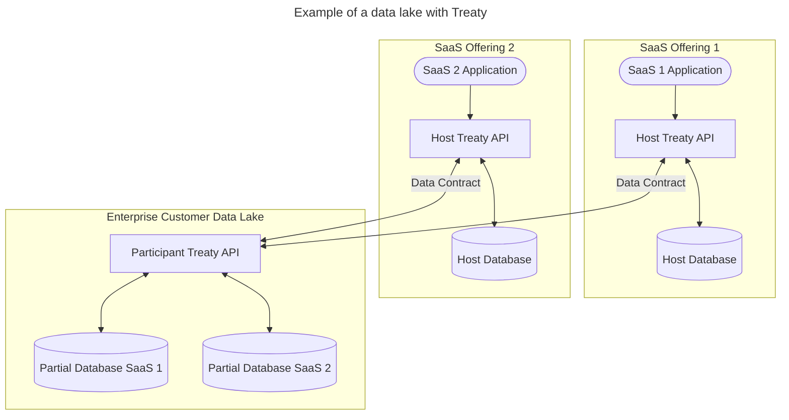
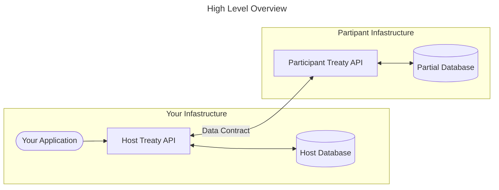

Manual for Treaty v0.1.0-alpha
==============

> Note: This document is incomplete and in-progress.

Welcome! This document is meant to provide a guide to the software design of Treaty along with it's internals: what tables it uses to enable cooperative data. It also aims to provide context behind the motivation for Treaty.

This document is targeted for `v0.1.0-alpha` of Treaty and it's associated software:

- treaty-client: A client library for interacting with a Treaty instance
- treaty-proxy: A Software as a Service (SaaS) version of Treaty, where there are multiple Treaty accounts
- treaty-admin: A website implemented in web-assembly for administration of Treaty (akin to pgsql or MySQLWorkbench)
- treaty-my-info: A website implemented in web-assembly for the administration of Treaty-Proxy (similiar to the above)

# Background, goals, disclaimers
## Background

To understand the intent behind Treaty, I think it might be useful to explain why it was invented.

Several years ago, a certain leader behind a large social network site on the internet was asked to provide to the United States Congress testimony about a situation that occurred with people's data.

At the time as a data warehouse and business intelligence developer, I joked with my co-workers: "Why can't this company just give me a SQL login to their database and permission me in so that I can see what data they have; but only for me?"

What was an offhand joke evolved into Treaty, or at least the intent behind Treaty: Give application developers the option to give users of their application first-class access to their data. First class access means doing so in a manner that I have termed "cooperative data".

### Cooperative Data
Cooperative data is the idea that data in a software application often contains components that don't originate with the the author of the software application. If you're developing an e-commerce website, you likely have modeled your database to support storing your inventory items in some database tables, and you've probably have tables to support your customer's information: Shipping Address, Billing Address, and so on.

The idea then is that inherently the _information_ in this database actually belongs to different people: You as the e-commerce site really are the final authority for what items you can sell on your online store front. Your customers, however, are the final authority on their address location, their name and contact information, and so on.

If we want to give our users rights to their data, this means a few principles I have settled on: 

- Our users must have access to their data. Access means full read and write permissions. 
- In addition, they need not only just access, but also an understanding of how it's used; they can see it and understand how it's being used in the greater database system. They don't need to see the actual _content_ in other database tables, but they need to understand how it ties in. They need to see the _schema_ of the database.
- They must have the right to determine _where_ their data is stored: either by an authority they trust, or on infastructure that they bring along. They must also have the option to _move_ that data to the infastructure of their choosing.
- Their data must always be _portable_. This means that they, if they wish, can import their data into other applications. It is _their_ data, and they must always be able to understand the format it's saved in.

I personally view these above concepts as sort of an "application data bill of rights." 

If you're a software developer, or familiar with software, you can probably already spot a bunch of technical problems with the above proposal. Let's unpack those problems.

### Referential integrity
For those that don't know, referential integrity in a database system means that data between two tables are consistent.  This means, for example, if you have a table that holds Employee information, and another table that holds Salary information for each employee, you want to ensure that there is always an employee for each salary record.

If you give users direct access to the database, they may (without understanding) delete or cause a mis-match between other components in the database system. How do we handle this? Of course, traditionally, you wouldn't ever give users direct access to the underlying database. You as an application developer always provide a "golden path" for your users to get to their information: through your application. 

There's also a problem of validation. The above situation doesn't mean that an application developer is doing something nefarious either. For example, websites often provide validators to ensure data is in the correct format: validating an email address is correct, or the format of a date, and so on. If we provide direct access to the database to our users, how do we make sure that the data entry is correct?

### Latency
The best network hop is the one that you didn't need to make. Networks can and do fail, and when they work, there's always a performance hit because sending packets and waiting for acknowledgement of packets takes time. In computer terms, waiting on the network is tremendously slower than just making requests local to the machine the database is on.

If we give our users the option to determine where their database is stored, we have an additional problem of performance: How can we be sure that a database transaction will work? What if the network call never gets answered?

### Exisiting database systems
None of the existing database systems on the market are engineered to even allow our cooperative data situation to occur; mainly for the above reasons.

## Treaty is an experiment
The above problems are real, and I want to be up-front about that. I originally had wanted to write Treaty as a new database system, and then quickly realized that:

- I'm way in over my head with no formal training in systems engineering.
- The market for databases is already full.
- This isn't something I can do in my spare time as a side project.

I had gotten some advice that what I may want to do instead is to write a plugin (specifically an FDR or [Foreign Data Wrapper](https://wiki.postgresql.org/wiki/Foreign_data_wrappers)) for a database system. While I was interested in this initally, I decided against that for a few reasons:

- Writing an FDW meant that I was tied to Postgres.
- Writing a FDW meant that I was tied to writing in C, which again, with no formal training, I was hestitant because I figured whatever I wrote would blow up in my face.

I wanted to enable a path where people could bring the database of their choice to store their information. I also wanted to write a system in a language that would help me help myself. I originally had some exposure to C#, which is a language that is garbage collected, and I wanted to implement Treaty in a language that was also going to help save me from myself.

Hence Treaty is written in Rust, and along the way I hope that within Treaty I can also implement some behaviors that Rust also provides: guidance when things go wrong. Specifically to the problem of referential integrity in a cooperative database, I want to provide warnings and errors to an application developer when these things do happen, so they can be gracefully handled in their application. 

With regard to latency as a problem, I wanted to acknowledge this as well, and provide once again _options_: You can choose to host your data where you want, or have the application developer host it for you. This is why `treaty` and `treaty-proxy` exist: to allow both.

## Goals for Treaty
I want to be specific since I've already mentioned a few things repeatedly, and it's useful to be explicit about intent.

Treaty aims:
- to enable the idea of "Cooperative Data"
- to help application developers implement this idea of "Cooperative Data" in a database system of their choosing
- to help enable users of applications to save their data in the database system or format (or infastructure) of their choosing

The goal is to try and provide a "paved road" for applications and technologies where people are writing applications today to implement cooperative data practices. I realize this is an ambitious goal, but I think that to drive the practice forward Treaty needs to assist in languages and databases of what developers are using. Practically this means databases that developers are using (SQL, Key-Value, Document) and languages that developers are using (Javascript, Python, Rust, Go, C#, etc). Generally, this also means providing the needed client versions and connectors to enable developers to "plug-in."

I also want to be explicit about the overall goal of data rights as a whole: I don't think technology alone can improve the current situation. I think steps legislative steps such as the [GDPR](https://gdpr-info.eu/) and others are also useful. Treaty (hopefully) is my (useful) contribution.

## Other projects and disclaimers
### Solid
I had also looked at the [Solid](https://solidproject.org/) project. I also want to see that project succeed; but speaking for myself when I used Solid I found myself struggling a bit with the specification first principle. Specifically, coming from a SQL based background, I wanted to use SQL rather than [RDF](https://www.w3.org/RDF/). 

I also want to be clear about this: While I have started with SQL, I want to help enable developers who aren't using SQL (Key-Value databases, or Document oriented databases) to also do so; or even just natively writing to disk.

I believe that I understand _why_ the Solid project takes the specification first principle: specifications are independent of a technology, and adopting open specifications means the maximum independence. My personal view, however, is that promoting a specification first principle doesn't help the problem of inertia: existing developers and applications have already established thoughts and patterns and applications that won't switch to a new specification just for a re-write. I hope that Treaty will be a useful alternative: take existing languages and databases and provide a pattern and API to enable that pattern to give people their data.

### Disclaimer 
If you've taken a look at the [demo](/treaty/docs/demo.md), you'll see that for `v0.1.0-alpha` that at the moment Treaty just accounts for the "happy path." I hope to work on shoring up for all of the non-happy paths that can happen in Treaty: network timeouts, missing database rows, etc. This is pretty ambitious for a project I'm doing in my spare time, but I hope that it can be successful. I also welcome (tactful) feedback and mentoring if available.

## Expansion of use cases
While I've described Treaty in terms of an application developer and their users, one of the other things I'm interested in is an understanding of how this might also work for enterprise users. Specifically, if you as a company are providing SaaS and you want to enable other enterprises access to their data. How could cooperative data work at an enterprise level? Could it help with building data lakes, for example?

As an example, here's an expansion of the diagram from the [README](/treaty/README.md).



# Overview

Treaty is an API that is intended to empower application developers to give users of their application their data. Alternatively, it can be described as a data sharing service.

Architecturally, your application instead of talking directly to a database instead talks to Treaty. Treaty in turn, depending on how it's configured and what you instruct it to do, will save data either at your database infastructure or your user's database infastructure. From the perspective of Treaty, you as the application developer are the _Host_ of the database, and your users are _Participants_ of the database.



For more information about how all of this comes together, I recommend reviewing the [README](/treaty/README.md) and reviewing the [demo](/treaty/docs/demo.md). There is also the [FAQ](/treaty/FAQ.md).

The API specification for Treaty is defined in [protobuf](/treaty/proto/treaty.proto) and gRPC and there is auto-generated [documentation](/treaty/proto/treaty_proto.md). The goal in defining protobuf first is that you can take protobuf and re-implement a client for Treaty in the language of your choice: Python, Go, C#, etc. For more information on protobuf, see the [site](https://protobuf.dev/).

Treaty itself is implemented in Rust, and for version `0.1.0-alpha` is backed by Sqlite.

# Startup

There are no pre-compiled binaries for Treaty at this time. To get an understanding of how it works, you will either need to compile Treaty on your platform or use docker. See the [demo](/treaty/docs/demo.md) for leveraging docker.

To start, clone this repo and navigate to the [treaty](/treaty/) folder. To run, issue `cargo run` in a terminal, which will attempt to start up Treaty.

On starting, Treaty looks for a `Settings.toml` file in the directory it is launched in. This file contains a few configuration settings:

```
database_type = 1
backing_database_name = "treaty.db"
grpc_client_service_addr_port = "0.0.0.0:50051"
grpc_data_service_addr_port = "0.0.0.0:50052"
http_addr = "0.0.0.0"
http_port = "50055"
admin_un = "tester"
admin_pw = "123456"
client_grpc_timeout_in_seconds = 60
data_grpc_timeout_in_seconds = 60
use_grpc = true
use_http = true
override_ip_with_local = true
```

| Item                           | Default Value   | Explanation                                                                                                                                                                       |
| ------------------------------ | --------------- | --------------------------------------------------------------------------------------------------------------------------------------------------------------------------------- |
| database_type                  | 1               | This is the type of database Treaty will use. This is defined in [enums.rs](/treaty/treaty-types/src/enums.rs) as `DatabaseType`. The only supported type at this time is Sqlite. |
| backing_database_name          | "treaty.db"     | This is the internal database that Treaty will use to store internal information, such as connection info, etc.                                                                   |
| grpc_client_service_addr_port  | "0.0.0.0:50051" | This is the IP address and port that Treaty will start the user service on. For more inforation, see the section on UserService.                                                  |
| grpc_data_service_addr_port    | "0.0.0.0:50052" | This is the IP address and port that Treaty will start the data service on. For more information, see the section on DataService.                                                 |
| http_addr                      | "0.0.0.0"       | This is the IP address that Treaty will host an HTTP endpoint on for HTTP + JSON communication. For more information, see the secton on HTTP.                                     |
| http_port                      | 50055           | This is the port number that Treaty will use for HTTP + JSON communication.                                                                                                       |
| admin_un                       | "tester"        | This is the default login for the admin user of Treaty.                                                                                                                           |
| admin_pw                       | "123456"        | This is the default pw for the admin user of Treaty.                                                                                                                              |
| client_grpc_timeout_in_seconds | 60              | This is the default gRPC timeout for communications on the User service.                                                                                                          |
| data_grpc_timeout_in_seconds   | 60              | This is the default gRPC timeout for cmmunications on the Data service.                                                                                                           |
| use_grpc                       | true            | This specifies if Treaty should expose gRPC ports on startup.                                                                                                                     |
| use_http                       | true            | This specifies if Treaty should expose an HTTP + JSON port on startup.                                                                                                            |
| override_ip_with_local         | true            | This specifies that Treaty should replace the specified IP address in the previous settings with the local detected IP. This was added to support docker.                         |

Treaty will create Sqlite databases to support requests from your application in the directory it is launched in.

(work in progress)